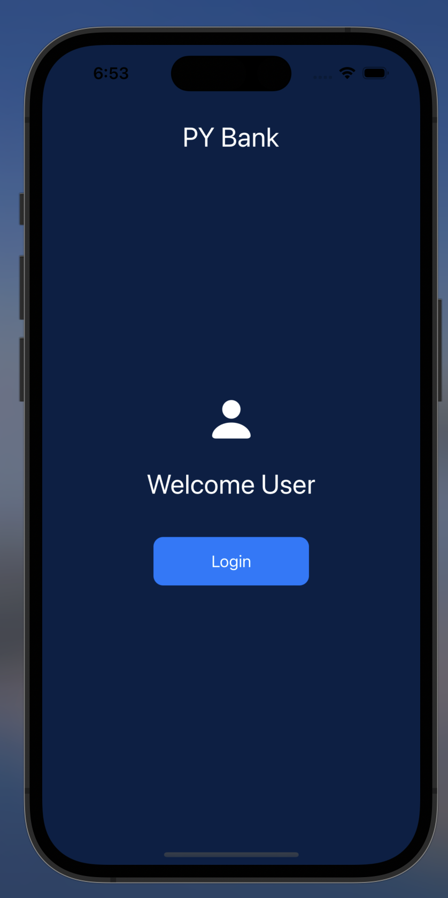

# Banking_App

This is an IOS app that shows the user different financial information from their account. 
The app is Biometric locked, and users will only have access once there is a matching FaceId or TouchId input recognized. 
    
    

The dashboard screen shows the user's total balance as a bolded title, and underneath it shows an image of their card, with the 3 most recent activites listed below that. 

In this app, there are 3 different credit cards belonging to the user, each with their own unique Recent Activity List. If the user swipes across the credit card image on the screen, their other card will show, along with its corresponding recent activities. 

On the transaction page, the user can choose to either make a new purchase or a new deposit. If a new purchase is selected, a dropdwon will appear prompting the user to input a Destination and Amount and the card they want to charge the purchase to. Once the save transaction button is pressed, the balance is then updated and the new transaction will appear in the recent activity list. 

New deposit is the same, only this time there is no Destination prompted as it is auto assigned to Deposit. The amount is then added to the balance and the information appears in green in the recent activity list. 

UserDefaults is used to save the balance changes so it is up to date each relaunch. Saving of the recent activity list is currently in progress, but will most likely require use of MongoDB integration. 

Profile tab currently has no information and will be created after MongoDB integration.  
